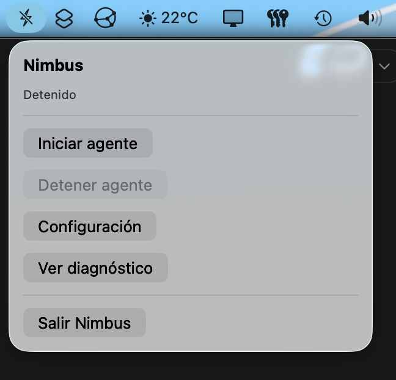
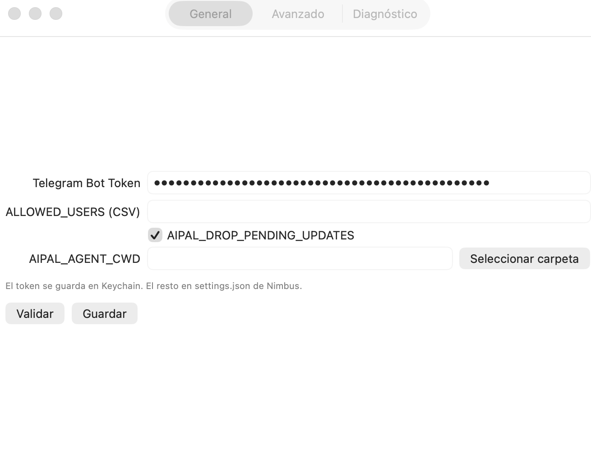
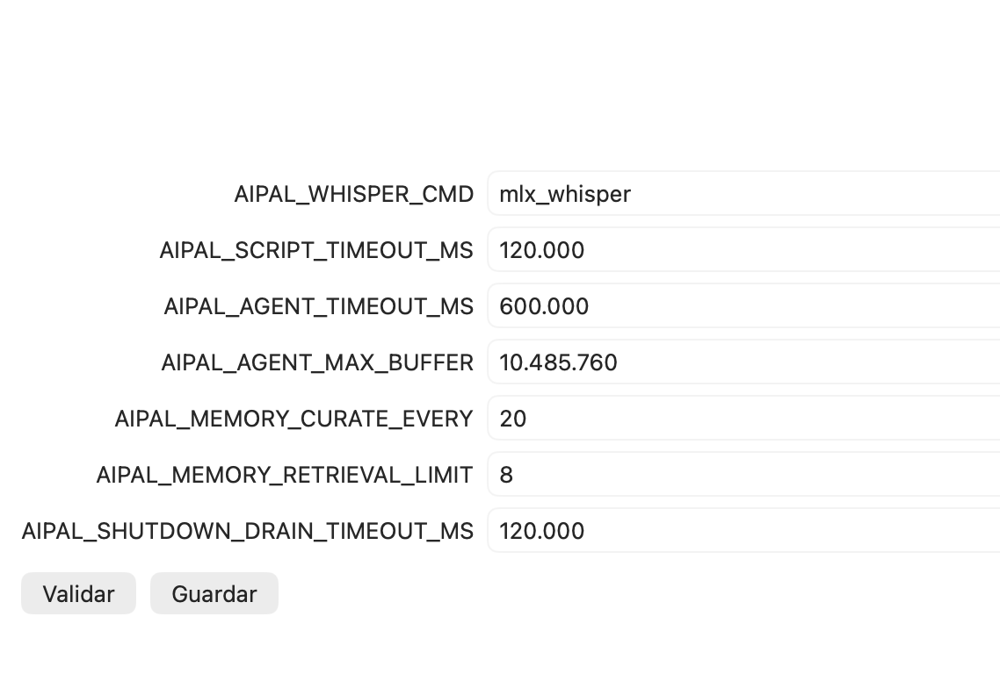

# NimbusAgent

NimbusAgent es una app de macOS en la barra de menús que empaqueta y ejecuta un bot de Telegram basado en **AIPAL** con runtime embebido (Node + código del agente), para arrancarlo y gestionarlo desde una interfaz nativa.

## Qué hace la app

- Inicia y detiene el agente desde el menú de macOS.
- Abre ventanas de **Configuración** y **Diagnóstico**.
- Ejecuta preflight antes de arrancar para validar requisitos.
- Muestra logs recientes y permite copiarlos para soporte.
- Guarda secretos y ajustes de forma separada:
  - `TELEGRAM_BOT_TOKEN` en Keychain.
  - Resto de settings en `~/Library/Application Support/NimbusAgent/settings.json`.

## Base del agente integrado (AIPAL)

Este proyecto integra AIPAL como runtime embebido.

- Repositorio original: [antoniolg/aipal](https://github.com/antoniolg/aipal)

## Flujo de uso

1. Abrir **Configuración** desde el menú de Nimbus.
2. Completar el token de Telegram y los parámetros necesarios.
3. Pulsar **Validar** para revisar preflight.
4. Pulsar **Guardar**.
5. Desde el menú, pulsar **Iniciar agente**.
6. Revisar estado y logs en **Diagnóstico**.

## Configuración

### General

- `TELEGRAM_BOT_TOKEN`: token del bot de Telegram (se guarda en Keychain).
- `ALLOWED_USERS` (CSV): restringe usuarios permitidos; si está vacío, el bot queda abierto.
- `AIPAL_DROP_PENDING_UPDATES`: evita procesar mensajes pendientes al arrancar.
- `AIPAL_AGENT_CWD`: carpeta de trabajo del agente (opcional).

Si `AIPAL_AGENT_CWD` está vacío, Nimbus usa por defecto `~/.config/aipal`.

### Avanzado

- `AIPAL_WHISPER_CMD` (por defecto: `parakeet-mlx`)
- `AIPAL_SCRIPT_TIMEOUT_MS` (por defecto: `120000`)
- `AIPAL_AGENT_TIMEOUT_MS` (por defecto: `600000`)
- `AIPAL_AGENT_MAX_BUFFER` (por defecto: `10485760`)
- `AIPAL_MEMORY_CURATE_EVERY` (por defecto: `20`)
- `AIPAL_MEMORY_RETRIEVAL_LIMIT` (por defecto: `8`)
- `AIPAL_SHUTDOWN_DRAIN_TIMEOUT_MS` (por defecto: `120000`)

### Diagnóstico

La pestaña de diagnóstico muestra:

- Estado del proceso (`Detenido`, `Iniciando`, `Activo`, `Deteniendo`, `Error`).
- Errores y warnings de preflight.
- Logs recientes del proceso.
- Botón para copiar diagnóstico completo.

## Capturas

### Menú de barra



### Configuración general



### Configuración avanzada



### Diagnóstico y logs


## Preparación del runtime embebido

Antes de compilar Nimbus, prepara el contenido de `Embedded/`:

```bash
./scripts/prepare_embedded_runtime.sh
```

El script:

- Copia AIPAL dentro de `Embedded/aipal`.
- Instala dependencias de producción si faltan.
- Copia un binario local de Node en `Embedded/runtime/node`.

Variables opcionales:

- `AIPAL_SRC`: ruta absoluta del repo de AIPAL (por defecto `../../aipal`).
- `NIMBUS_NODE_BIN`: ruta absoluta al binario de Node a embeber.

## Desarrollo

1. Prepara runtime embebido (paso anterior).
2. Abre `NimbusAgent.xcodeproj` en Xcode.
3. Compila y ejecuta el target de la app.

## Notas

- En preflight, Nimbus también valida que `codex` exista en `PATH`.
- Si `AIPAL_WHISPER_CMD` no existe en `PATH`, se muestra warning.
